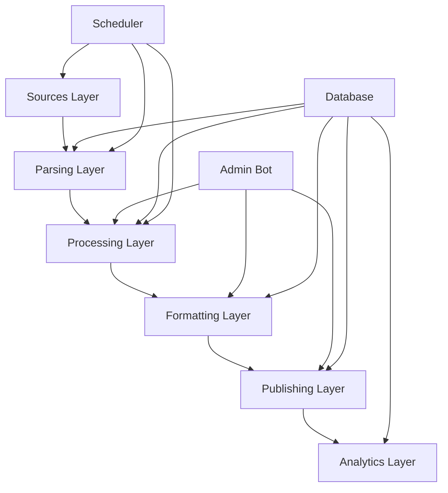

Отлично! Давайте начнем с детального плана реализации MVP, а затем перейдем к архитектурным решениям.

# 📝 1. ДЕТАЛЬНЫЙ ПЛАН РЕАЛИЗАЦИИ MVP (3-5 ДНЕЙ)

## 📅 **День 1: Подготовка и настройка среды**

### Задачи:
- [ ] **Установка и настройка**:
  - Python 3.9+ на сервере
  - PostgreSQL (создание базы данных)
  - Docker (для контейнеризации)
  - Virtualenv/Conda

- [ ] **Создание структуры проекта**:
  ```
  ai-news-hub/
  ├── app/
  │   ├── __init__.py
  │   ├── config.py
  │   ├── database.py
  │   ├── parsers/
  │   │   ├── __init__.py
  │   │   ├── base_parser.py
  │   │   └── techcrunch_parser.py
  │   ├── telegram/
  │   │   ├── __init__.py
  │   │   ├── bot.py
  │   │   └── admin_bot.py
  │   ├── utils/
  │   │   ├── __init__.py
  │   │   ├── logger.py
  │   │   └── helpers.py
  │   └── main.py
  ├── requirements.txt
  ├── Dockerfile
  └── docker-compose.yml
  ```

- [ ] **Настройка базы данных**:
  - Создание таблиц: `sources`, `news`, `publications`, `analytics`
  - Настройка соединения с PostgreSQL

- [ ] **Базовая конфигурация**:
  - API-ключи (Telegram Bot API)
  - Настройки парсеров
  - Логирование

## 📅 **День 2: Разработка парсеров и базовой логики**

### Задачи:
- [ ] **Создание базового класса парсера** (`base_parser.py`):
  ```python
  class BaseParser:
      def __init__(self, source_url, source_id):
          self.source_url = source_url
          self.source_id = source_id
      
      def parse(self):
          raise NotImplementedError
      
      def extract_content(self, html):
          # Базовая логика извлечения контента
          pass
      
      def extract_image(self, html):
          # Извлечение og:image
          pass
  ```

- [ ] **Разработка 3-5 парсеров**:
  - TechCrunch parser
  - The Verge parser  
  - Hi, AI! parser
  - Точки над ИИ parser
  - OpenAI blog parser

- [ ] **Система фильтрации**:
  - Базовая фильтрация по ключевым словам
  - Проверка на дубликаты (по заголовку)
  - Оценка релевантности

- [ ] **Обработка изображений**:
  - Извлечение og:image
  - Кэширование изображений локально
  - Генерация превью для Telegram

## 📅 **День 3: Разработка Telegram-бота и публикации**

### Задачи:
- [ ] **Создание Telegram-бота** (`telegram/bot.py`):
  ```python
  class NewsBot:
      def __init__(self, token):
          self.bot = telebot.TeleBot(token)
          self.setup_handlers()
      
      def setup_handlers(self):
          @self.bot.message_handler(commands=['start'])
          def start_message(message):
              # Приветственное сообщение
              pass
          
          @self.bot.callback_query_handler(func=lambda call: True)
          def callback_query(call):
              # Обработка кнопок
              pass
  ```

- [ ] **Админ-панель** (`telegram/admin_bot.py`):
  - Кнопки: "Опубликовать", "Отклонить", "Отредактировать", "Отложить"
  - Отправка постов на утверждение
  - Логирование действий

- [ ] **Система публикации**:
  - Отправка постов в Telegram-канал
  - Форматирование текста под Telegram
  - Добавление ссылки на источник
  - Обработка ошибок публикации

- [ ] **Базовая аналитика**:
  - Логирование просмотров, реакций
  - Сохранение метрик в базу данных

## 📅 **День 4: Тестирование и отладка**

### Задачи:
- [ ] **Локальное тестирование**:
  - Unit-тесты для парсеров
  - Интеграционные тесты
  - Тестирование Telegram-бота

- [ ] **Первые тестовые публикации**:
  - Ручная проверка 10-20 новостей
  - Анализ качества парсинга
  - Корректировка логики

- [ ] **Настройка scheduling**:
  - APScheduler для регулярного запуска
  - Настройка времени публикации
  - Резервное планирование

- [ ] **Мониторинг**:
  - Логирование ошибок
  - Отчеты в Telegram-чат
  - Алерты при сбоях

## 📅 **День 5: Запуск и финальные настройки**

### Задачи:
- [ ] **Развертывание на сервере**:
  - Docker-контейнер
  - Настройка systemd-сервиса
  - Резервное копирование

- [ ] **Первые реальные публикации**:
  - Ручное одобрение первых постов
  - Мониторинг работы системы
  - Корректировка параметров

- [ ] **Документация**:
  - Инструкция по запуску
  - Описание конфигурации
  - План расширения

- [ ] **Планирование следующих этапов**:
  - Добавление новых источников
  - Улучшение ML-фильтрации
  - Разработка дашборда

---

# 🛠️ 2. АРХИТЕКТУРНЫЕ РЕШЕНИЯ И ВЫБОР ТЕХНОЛОГИЙ

## 🏗️ **Архитектурная схема**



## 📊 **Выбор технологий**

### Backend:
- **Язык**: Python 3.9+ (стабильность, богатая экосистема)
- **Фреймворк**: FastAPI (высокая производительность, автоматическая документация)
- **Асинхронность**: asyncio (для параллельного парсинга)
- **База данных**: PostgreSQL (надежность, мощные запросы)
- **Кэширование**: Redis (для временных данных, сессий)

### Парсинг:
- **Основной**: BeautifulSoup (простота, надежность)
- **Для сложных сайтов**: Scrapy (мощь, производительность)
- **API-клиенты**: requests (для REST API источников)

### Telegram:
- **Библиотека**: Telethon (полный доступ к API, асинхронность)
- **Боты**: aiogram (простота, хорошая документация)

### Обработка изображений:
- **Основной**: Pillow (простота, широкая поддержка)
- **Оптимизация**: ImageMagick (для сложных операций)

### Планирование:
- **Основной**: APScheduler (гибкость, поддержка различных бэкендов)
- **Альтернатива**: Celery (для сложных задач)

### Контейнеризация:
- **Docker**: Упрощение развертывания
- **Docker Compose**: Управление мульти-контейнерными приложениями

### Мониторинг:
- **Логирование**: structlog (структурированные логи)
- **Мониторинг**: Prometheus + Grafana (для продакшена)
- **Алерты**: Sentry (для ошибок)

## 🔧 **Детальные технические решения**

### 1. **Парсинг и извлечение данных**
```python
# Пример базового парсера
class BaseParser:
    def __init__(self, source_config):
        self.source_config = source_config
        self.session = requests.Session()
        self.session.headers = {
            'User-Agent': 'Mozilla/5.0 (Windows NT 10.0; Win64; x64) AppleWebKit/537.36',
            'Accept': 'text/html,application/xhtml+xml,application/xml;q=0.9,*/*;q=0.8'
        }
    
    async def parse(self):
        html = await self._fetch_html()
        soup = BeautifulSoup(html, 'html.parser')
        articles = self._extract_articles(soup)
        return await self._process_articles(articles)
    
    async def _fetch_html(self):
        try:
            response = await self.session.get(self.source_config['url'])
            response.raise_for_status()
            return response.text
        except Exception as e:
            logger.error(f"Failed to fetch {self.source_config['url']}: {e}")
            return None
```

### 2. **Обработка изображений**
```python
# Пример обработки изображений
class ImageProcessor:
    def __init__(self, cache_dir='images/cache'):
        self.cache_dir = cache_dir
        os.makedirs(cache_dir, exist_ok=True)
    
    def process_image(self, image_url, news_id):
        # Проверяем кэш
        cached_path = self._get_cached_path(image_url, news_id)
        if os.path.exists(cached_path):
            return cached_path
        
        # Скачиваем изображение
        image_data = self._download_image(image_url)
        if not image_data:
            return None
        
        # Оптимизируем для Telegram
        optimized_path = self._optimize_image(image_data, news_id)
        return optimized_path
    
    def _optimize_image(self, image_data, news_id):
        img = Image.open(io.BytesIO(image_data))
        # Ресайз до 1200x630 (оптимальный размер для Telegram)
        img.thumbnail((1200, 630), Image.LANCZOS)
        # Сохраняем с оптимизацией
        output_path = self._get_cached_path(image_url, news_id)
        img.save(output_path, 'JPEG', quality=85, optimize=True)
        return output_path
```

### 3. **Telegram-бот**
```python
# Пример Telegram-бота
class NewsBot:
    def __init__(self, token, channel_id):
        self.bot = telebot.TeleBot(token)
        self.channel_id = channel_id
        self.setup_handlers()
    
    def setup_handlers(self):
        @self.bot.message_handler(commands=['start'])
        def start_message(message):
            self.bot.send_message(
                message.chat.id,
                "Добро пожаловать в систему публикации новостей!"
            )
        
        @self.bot.callback_query_handler(func=lambda call: True)
        def callback_query(call):
            if call.data == 'publish':
                # Логика публикации
                pass
            elif call.data == 'reject':
                # Логика отклонения
                pass
```

### 4. **Система публикации**
```python
# Пример системы публикации
class Publisher:
    def __init__(self, bot, channel_id):
        self.bot = bot
        self.channel_id = channel_id
    
    async def publish(self, news_item):
        try:
            # Форматируем текст
            text = self._format_text(news_item)
            
            # Подготовка медиа
            media = await self._prepare_media(news_item)
            
            # Публикация
            if media:
                message = await self.bot.send_photo(
                    self.channel_id,
                    media,
                    caption=text,
                    parse_mode='Markdown'
                )
            else:
                message = await self.bot.send_message(
                    self.channel_id,
                    text,
                    parse_mode='Markdown'
                )
            
            # Сохраняем метрики
            await self._save_metrics(message, news_item)
            
            return True
            
        except Exception as e:
            logger.error(f"Failed to publish: {e}")
            return False
```

### 5. **Аналитика**
```python
# Пример системы аналитики
class Analytics:
    def __init__(self, db_session):
        self.db = db_session
    
    async def track_view(self, post_id, user_id=None):
        # Логируем просмотр
        pass
    
    async def track_reaction(self, post_id, reaction_type, user_id=None):
        # Логируем реакцию
        pass
    
    async def generate_daily_report(self):
        # Генерируем ежедневный отчет
        report = {
            'date': datetime.now().date(),
            'total_posts': await self._get_total_posts(),
            'engagement_rate': await self._calculate_er(),
            'top_sources': await self._get_top_sources()
        }
        return report
```

## 📈 **Масштабируемость и производительность**

### 1. **Производительность**:
- **Асинхронный парсинг**: Обработка нескольких источников одновременно
- **Параллельные задачи**: Использование asyncio для одновременных операций
- **Кэширование**: Redis для временных данных, уменьшение нагрузки на БД

### 2. **Масштабируемость**:
- **Микросервисная архитектура**: Разделение на отдельные сервисы (парсинг, публикация, аналитика)
- **Очереди**: RabbitMQ/Redis для обработки задач
- **Контейнеризация**: Docker для легкого развертывания новых экземпляров

### 3. **Надежность**:
- **Резервное копирование**: Ежедневные бэкапы БД
- **Мониторинг**: Prometheus + Grafana для отслеживания метрик
- **Алерты**: Sentry для ошибок, Telegram-уведомления

## 🔒 **Безопасность**

### 1. **Защита API**:
- **Токены**: Хранение в переменных окружения
- **OAuth**: Для доступа к внешним API
- **Rate limiting**: Ограничение запросов к источникам

### 2. **Защита данных**:
- **Шифрование**: Ключей API, конфиденциальных данных
- **Валидация**: Входных данных для предотвращения инъекций
- **Аутентификация**: Для админ-панели

## 📋 **План тестирования**

### 1. **Unit-тесты**:
- Тестирование парсеров
- Тестирование обработки изображений
- Тестирование форматирования текста

### 2. **Интеграционные тесты**:
- Тестирование работы с Telegram API
- Тестирование работы с БД
- Тестирование полного цикла публикации

### 3. **Нагрузочное тестирование**:
- Тестирование производительности при 10+ источниках
- Тестирование работы под нагрузкой

---

